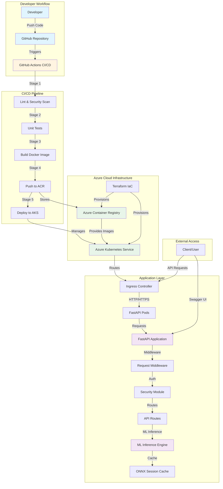

**MedAI_Flow_DevSecOps — Secure Medical AI DevSecOps Platform:**
This repository demonstrates a secure, automated, and standards-compliant CI/CD pipeline for medical imaging AI software.
It integrates FastAPI, Azure Cloud (AKS + ACR), and GitHub Actions to showcase a production-grade, audit-ready DevSecOps workflow aligned with IEC 62304, ISO 13485, ISO 14971, ISO 27001, and FDA 21 CFR 820.

**Key Features:**

- **FastAPI Backend** - Low-latency AI/ML model inference with typed APIs
- **Environment-Based Configuration** - Pydantic BaseSettings for secure config management
- **Request Middleware** - Correlation IDs and request timing for observability
- **ONNX Session Caching** - Optimized model inference performance
- **Docker Containerization** - Reproducible deployment
- **Terraform (IaC)** - Provision Azure resources (RG + ACR + AKS)
- **GitHub Actions CI/CD** - Automated build, test, and deployment
- **DevSecOps Integration** - Linting, static analysis, and security scanning
- **Scalable Kubernetes Deployment** - Azure AKS + LoadBalancer ingress
- **Compliance Templates** - FDA and ISO documentation alignment

**Project Structure:**
MedAI_Flow_DevSecOps/
│
├── .flake8
├── .gitattributes
├── .github
│   └── workflows
│       └── main.yml                         # CI/CD pipeline
|
├── .gitignore
├── .venv
|
├── AZURE_CREDENTIALS.json
├── backend                                  # FastAPI backend source
│   ├── app
│   │   ├── config.py                        # Environment-based configuration
│   │   ├── main.py                          # FastAPI app initialization
│   │   ├── middleware.py                    # Request middleware (correlation IDs, timing)
│   │   ├── routes.py                        # API endpoints (typed POST /infer)
│   │   ├── security.py                      # Bearer token authentication
│   │   └── utils.py                         # Utility functions (latency timer)
│   └── Dockerfile
|
├── ci-cd
│   └── github-actions.yml
+ # (Optional)
+ # ci-cd/github-actions.yml — legacy or sample workflow, not used in production pipeline
├── compliance                               # Regulatory documentation templates
│   ├── fda_21cfr820_traceability_matrix.md
│   ├── iso_27001_security_controls.md
│   ├── iso_62304_lifecycle_plan.md
│   └── risk_management_summary.md
|
├── docs                                    # Architecture & visual documentation
│   ├── ARCHITECTURE.md                     # System architecture documentation
│   ├── architecture_diagram.png            # Legacy diagram (use ARCHITECTURE.md)
│   ├── DEVELOPMENT_PLAN.md                 # Comprehensive development roadmap
│   ├── latency_scaling_summary.md
│   └── pipeline_flow.png
|
├── infra                                  # Infrastructure and scripts
│   ├── aks_deploy.yaml                    # Kubernetes deployment manifest
│   ├── ingress.yaml
│   ├── scripts
│   │   └── verify_acr_access.ps1          # PowerShell ACR verification script
│   ├── storage.yaml
│   └── terraform                          # Azure IaC provisioning
│       ├── .terraform
│       ├── .terraform.lock.hcl
│       ├── main.tf
│       └── terraform.tfstate
|
├── ml                                    # AI model modules (future integration)
│   ├── cache_manager.py
│   ├── inference.py
│   └── preprocess.py
|
├── notebooks
├── README.md
└── tests
    ├── test_api.py
    ├── test_model.py
    └── test_security.py

**CI/CD Pipeline Overview**

Every **push or PR to `main`** triggers the following automated stages (GitHub Actions → [`.github/workflows/main.yml`](.github/workflows/main.yml)):

| Stage | Purpose | Tools | Status |
|-------|---------|-------|--------|
| **Lint & Security Scan** | Enforces coding standards and static security analysis | flake8, bandit | Passed |
| **Unit Tests** | Validates API logic and integration | pytest, FastAPI TestClient | Passed |
| **Build & Push** | Builds and publishes Docker images to Azure Container Registry (ACR) | Docker, az acr login | Passed |
| **Deploy** | Deploys application to Azure Kubernetes Service (AKS) and verifies rollout | kubectl, az aks | Passed |

All jobs run in GitHub-hosted Ubuntu runners — no local Docker required.
Pip caching is enabled to reduce CI runtime by >30%.

**How to Review and Run This Project:**
For Reviewers (No Setup Required)

     1. Visit the repository’s Actions tab to see all four CI/CD stages passing (green checkmarks).

     2. Review logs, code, and documentation directly from GitHub — no local setup, Docker, or Azure login required.

# For Local Testing (Optional):
You can run the FastAPI backend locally without Docker or Azure.

```bash
# Clone the repository
git clone https://github.com/Transvolve/MedAI_Flow_DevSecOps.git
cd MedAI_Flow_DevSecOps/backend

# Install dependencies (includes FastAPI, Uvicorn, Pytest, Flake8, Bandit)
pip install -r ../requirements-ci.txt

# Run the FastAPI app
uvicorn app.main:app --reload --host 0.0.0.0 --port 8080
```

# Access locally at:
http://127.0.0.1:8080/health          # Health check endpoint
http://127.0.0.1:8080/version        # Version endpoint
http://127.0.0.1:8080/docs           # Interactive API documentation (Swagger UI)
http://127.0.0.1:8080/infer          # ML inference endpoint (POST, requires Bearer token)

# API Usage Example:
# POST /infer requires Bearer token authentication
curl -X POST "http://127.0.0.1:8080/infer" \
  -H "Authorization: Bearer test-token" \
  -H "Content-Type: application/json" \
  -d '{"data": [0.0, 1.0, 0.5]}'

# Configuration:
# Environment variables can be set via .env file or environment variables:
# - API_TOKEN: Bearer token for authentication (default: "test-token")
# - APP_NAME: Application name (default: "MedAI Flow Backend")
# - APP_VERSION: Application version (default: "1.0")

# Tip: If your IDE or terminal warns that packages like uvicorn, flake8, pytest, or bandit are not installed, ensure the correct Python environment is activated and re-run the pip install command above.

## Testing & Virtual Environment (recommended)

Use a virtual environment for reproducible local testing and to match the CI environment. From the repository root (PowerShell):

```powershell
# Create virtual environment (if missing)
python -m venv .venv
# Activate for the current PowerShell session
Set-ExecutionPolicy -ExecutionPolicy RemoteSigned -Scope Process -Force
. .\.venv\Scripts\Activate.ps1
# Install test/dev dependencies
pip install -r requirements-ci.txt
```

Run the test suite with the venv Python so the same interpreter and packages used in CI are used locally:

```powershell
python -m pytest -q
```

Note: tests interact with the Prometheus exposition format. Different versions of `prometheus_client` expose metric "families" using slightly different family-name conventions (some parsers present the family as `rate_limit_hits` while the sample within it appears as `rate_limit_hits_total`). Tests in this repository have been made tolerant to either naming style to avoid brittle failures when CI or local dependency versions are upgraded. We recommend keeping tests tolerant rather than pinning that dependency, unless strict reproducibility is required for a release.


# For CI/CD Reference

The automated GitHub Actions pipeline installs the same dependencies from requirements-ci.txt during every run to guarantee consistent environments between local testing and the hosted runner.

**Architecture Overview**

For detailed architecture documentation, see [`docs/ARCHITECTURE.md`](docs/ARCHITECTURE.md).

**System Architecture Diagram:**



**Code & Architecture:**

**API Endpoints:**
- `GET /health` - Health check endpoint (no authentication required)
- `GET /version` - Returns application version (no authentication required)
- `POST /infer` - ML model inference endpoint (requires Bearer token authentication)
  - Request body: `{"data": [float, ...], "width": int (optional), "height": int (optional)}`
  - Response: `{"result": {"outputs": ...}, "latency_ms": float}`

**Key Components:**
- `config.py` - Environment-based configuration using Pydantic BaseSettings
- `middleware.py` - Request middleware for correlation IDs and timing headers
- `routes.py` - Typed API endpoints with Pydantic request/response models
- `security.py` - Bearer token authentication
- `ml/inference.py` - ONNX model inference with session caching

Browse source code, Terraform scripts, and CI/CD workflows to see how automation and compliance are integrated.

**Container & Deployment (Cloud)**
All container builds and deployments occur automatically in the pipeline:
1. Build image → push to Azure Container Registry (medaiflowacr)
2. Deploy container → Azure Kubernetes Service (rg-medai-flow)
3. Rollout verification via kubectl rollout status
4. Azure RBAC validation via infra/scripts/verify_acr_access.ps1

**Infrastructure as Code**
Terraform (infra/terraform) provisions:
1. Azure Resource Group (rg-medai-flow)
2. Azure Container Registry (ACR)
3. Azure Kubernetes Service (AKS)
State files & secrets are excluded from version control.
Secrets handled via GitHub Secrets and Azure Key Vault.

**Security & Compliance Notes:**
* No personal credentials or Terraform state files are committed.
* Environment variables and secrets are managed via GitHub Secrets and Azure Key Vault.
* Security scanning (bandit, flake8) is integrated into the CI/CD pipeline.
* Project artifacts follow IEC 62304 lifecycle and ISO 27001 security controls templates.
* Distributed rate limiting with Redis backend ([Rate Limiting Documentation](docs/RATE_LIMITING.md))
* JWT-based authentication with role-based access control
* Security headers (CSP, HSTS) and CORS protection

**Security & Compliance Highlights**

| Control Area | Implementation | Reference |
|--------------|----------------|-----------|
| **Secure Coding** | Linting + Static Scan | `flake8`, `bandit` |
| **Credential Management** | GitHub Secrets + Azure Key Vault | `.github/workflows/main.yml` |
| **Infrastructure Integrity** | Terraform IaC | `/infra/terraform` |
| **Software Lifecycle** | IEC 62304-compliant docs | `/compliance/iso_62304_lifecycle_plan.md` |
| **Risk Management** | ISO 14971 mapping | `/compliance/risk_management_summary.md` |
| **Traceability** | CFR 21 Part 820 Matrix | `/compliance/fda_21cfr820_traceability_matrix.md` |


**Summary**

| Area | Technology | Purpose |
|------|------------|---------|
| **Infrastructure** | Terraform + Azure AKS/ACR | Automated provisioning |
| **Application** | Python 3.11 / FastAPI | Medical imaging backend |
| **CI/CD** | GitHub Actions | Continuous Integration + Deployment |
| **Security** | Bandit / Flake8 / RBAC | DevSecOps Compliance |
| **Compliance** | ISO 13485, 62304, 14971, 27001 | Medical Software Lifecycle |

**Demo Instructions**
1. Open the repository → Actions tab
     → Show all 4 pipeline stages are green.

2. Open docs/ARCHITECTURE.md
     → Show system architecture diagram and data flow.

3. Open .github/workflows/main.yml
     → Explain each CI/CD stage (lint, test, build, deploy).

4. Show /infra/scripts/verify_acr_access.ps1
     → Demonstrate Azure authentication verification.

5. Open /compliance/iso_62304_lifecycle_plan.md
     → Show traceability and lifecycle documentation.

6. (Optional): Run locally → uvicorn app.main:app
     → Show /health, /version, and /infer endpoints live.
     → Demonstrate POST /infer with Bearer token authentication.

**Branching & Testing Workflow**

| Branch | Purpose |
|--------|---------|
| `main` | Stable production-ready pipeline |
| `feature/*` | Experimental branches for testing & new features |

Typical flow:
git checkout -b feature/test-latency-fix
# make edits → commit → push
git push -u origin feature/test-latency-fix
# then open PR → merge into main → auto CI/CD run

Manual triggers also available via Run workflow button (workflow_dispatch).

**Development Roadmap**

This project follows a dual-track development approach: **Regulatory Compliance** (Phase 1-7) and **Performance & Scalability** (Phase 2-6). Both tracks run in parallel to ensure regulatory readiness while maintaining operational excellence.

**Detailed Development Plan:** See [`docs/DEVELOPMENT_PLAN.md`](docs/DEVELOPMENT_PLAN.md) for comprehensive phase-by-phase deliverables, timelines, and implementation details.

---

### Track 1: Regulatory Compliance & Commercial Readiness (Phase 1-7)
**Priority: HIGH** — Required for FDA submissions and commercial contracts

| Phase | Focus Area | Timeline | Priority |
|-------|------------|----------|----------|
| **Phase 1** | Security Hardening<br>(JWT auth, security headers, rate limiting) | Week 1-2 | HIGH |
| **Phase 2** | Input Validation & Error Handling | Week 2-3 | HIGH |
| **Phase 3** | Structured Logging & Audit Trails | Week 3-4 | HIGH |
| **Phase 4** | Test Coverage Expansion<br>(>80% coverage) | Week 4-5 | HIGH |
| **Phase 5** | CI/CD Enhancements<br>(mypy, SBOM, vulnerability scanning) | Week 5-6 | MEDIUM-HIGH |
| **Phase 6** | Documentation & Compliance Mapping | Week 6-7 | MEDIUM |
| **Phase 7** | Commercial Readiness<br>(demo UI, validation reports, services) | Week 7-8 | MEDIUM |

**Key Deliverables:**
- JWT authentication with role-based access control
- Comprehensive input validation with clinical constraints
- Structured logging with PHI-safe audit trails
- >80% test coverage (unit, integration, security tests)
- SBOM generation and vulnerability scanning
- FDA-ready compliance documentation
- Professional demo UI and service packages

**Impact:** [5/5] Regulatory compliance | [5/5] Commercial readiness

---

### Track 2: Performance & Scalability (Phase 2-6)
**Priority: MEDIUM-HIGH** — Operational excellence and production readiness

| Phase | Focus Area | Timeline | Priority |
|-------|------------|----------|----------|
| **Phase 2** | Performance & Latency Optimization | Week 2-3 | MEDIUM-HIGH |
| **Phase 3** | Reliability & Observability | Week 3-4 | MEDIUM-HIGH |
| **Phase 4** | Scalability & Resource Optimization | Week 4-5 | MEDIUM |
| **Phase 5** | Modular Architecture Alignment | Week 5-6 | MEDIUM |
| **Phase 6** | Advanced Security & Compliance Automation | Week 6-7 | MEDIUM |

**Key Deliverables:**
- Async FastAPI routes with optimized I/O
- Caching layer (Redis/LRU) for repeat inference
- OpenTelemetry tracing & Prometheus/Grafana dashboards
- Horizontal Pod Autoscaler (HPA) in AKS
- Message queue (Azure Service Bus/RabbitMQ) for async jobs
- Micro-modules architecture with DDD
- Container signing & attestation (Cosign/Sigstore)

**Impact:** [4/5] Performance | [4/5] Scalability | [3/5] Reliability

**License**
This project will be released under the MIT License (LICENSE file to be added in the next update).

**Contributions:**
Contributions and extensions (e.g., model training, advanced monitoring, IaC enhancements) are welcome via pull requests.
Please ensure commits maintain compliance traceability and secure coding standards.

**Author**
Dr. Mehul Pancholi, PhD (Biomedical Engineering)
Senior System & Software Engineer | Embedded IoT | AI/ML | Medical Device DevSecOps
London, UK | LinkedIn: https://www.linkedin.com/in/mehul-pancholi-284453b/ 
