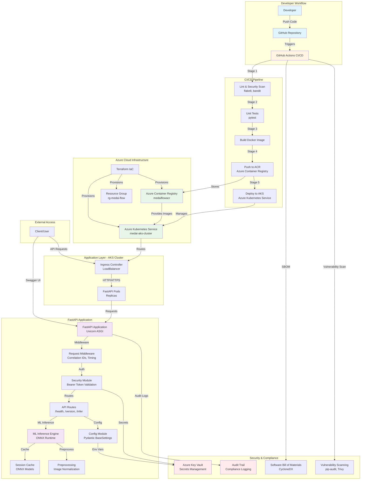

# MedAI Flow DevSecOps - Architecture Overview

## System Architecture Diagram



## Architecture Layers

### 1. Developer & Source Control Layer
- **GitHub Repository**: Source code version control
- **GitHub Actions**: CI/CD orchestration
- **Branch Strategy**: `main` for production, `feature/*` for development

### 2. CI/CD Pipeline Layer
- **Stage 1 - Lint & Security**: Code quality (flake8) and security scanning (bandit)
- **Stage 2 - Unit Tests**: Automated testing (pytest)
- **Stage 3 - Build**: Docker image creation
- **Stage 4 - Push**: Image pushed to Azure Container Registry
- **Stage 5 - Deploy**: Kubernetes deployment to AKS

### 3. Infrastructure Layer (Azure)
- **Terraform**: Infrastructure as Code provisioning
- **Resource Group**: Logical container for Azure resources
- **Azure Container Registry (ACR)**: Private Docker registry
- **Azure Kubernetes Service (AKS)**: Managed Kubernetes cluster
- **Ingress Controller**: LoadBalancer for external access

### 4. Application Layer
- **FastAPI**: Python web framework (ASGI)
- **Uvicorn**: ASGI server
- **Request Middleware**: Correlation IDs, request timing
- **Security Module**: Bearer token authentication
- **Config Module**: Environment-based configuration (Pydantic BaseSettings)
- **API Routes**: RESTful endpoints (`/health`, `/version`, `/infer`)

### 5. ML Inference Layer
- **ONNX Runtime**: Model inference engine
- **Session Cache**: Cached ONNX sessions for performance
- **Preprocessing**: Image normalization and validation
- **Inference Engine**: Model prediction execution

### 6. Security & Compliance Layer
- **Azure Key Vault**: Secrets management
- **Audit Trail**: Compliance logging
- **SBOM Generation**: Software Bill of Materials (CycloneDX)
- **Vulnerability Scanning**: Dependency and container scanning

## Data Flow

### Request Flow (Inference Endpoint)
```
Client Request
    ↓
Ingress Controller (LoadBalancer)
    ↓
FastAPI Pod (Kubernetes)
    ↓
Request Middleware (Correlation ID, Timing)
    ↓
Security Module (Bearer Token Validation)
    ↓
Routes Module (/infer endpoint)
    ↓
ML Inference Engine
    ↓
ONNX Runtime (Cached Session)
    ↓
Preprocessing (Image Normalization)
    ↓
Model Inference
    ↓
Response (with latency_ms)
    ↓
Client
```

### CI/CD Flow
```
Developer Push
    ↓
GitHub Repository
    ↓
GitHub Actions Trigger
    ↓
Lint & Security Scan
    ↓
Unit Tests
    ↓
Docker Build
    ↓
Push to ACR
    ↓
Deploy to AKS
    ↓
Rollout Verification
```

## Technology Stack

| Layer | Technology | Purpose |
|-------|------------|---------|
| **Language** | Python 3.11 | Application runtime |
| **Framework** | FastAPI | Web API framework |
| **Server** | Uvicorn | ASGI server |
| **ML Runtime** | ONNX Runtime | Model inference |
| **Container** | Docker | Application packaging |
| **Orchestration** | Kubernetes (AKS) | Container orchestration |
| **Infrastructure** | Terraform | Infrastructure as Code |
| **CI/CD** | GitHub Actions | Automation pipeline |
| **Registry** | Azure Container Registry | Container storage |
| **Cloud** | Azure | Cloud platform |

## Security Architecture

### Authentication & Authorization
- **Bearer Token**: API authentication
- **Azure Key Vault**: Secure secrets storage
- **Environment Variables**: Configuration via `.env` files

### Security Scanning
- **Static Analysis**: Bandit (Python security)
- **Code Quality**: Flake8 (linting)
- **Dependency Scanning**: pip-audit
- **Container Scanning**: Trivy (future)

### Compliance
- **Audit Logs**: Request/response logging with correlation IDs
- **Traceability**: Requirement → Code → Test mapping
- **SBOM**: Software Bill of Materials for dependency tracking

## Scalability & Performance

### Horizontal Scaling
- **Kubernetes Replicas**: Multiple FastAPI pods
- **LoadBalancer**: Traffic distribution
- **Auto-scaling**: HPA (Horizontal Pod Autoscaler) - future

### Performance Optimization
- **ONNX Session Caching**: Reuse model sessions
- **Request Middleware**: Minimal overhead timing
- **Async Processing**: FastAPI async routes

## Deployment Architecture

### Development Environment
- Local development with `uvicorn` server
- Environment variables via `.env` file
- Direct API access on `localhost:8080`

### Production Environment
- Azure Kubernetes Service (AKS)
- LoadBalancer for external access
- Container images from Azure Container Registry
- Managed by Terraform Infrastructure as Code

## Monitoring & Observability

### Current Implementation
- **Request Timing**: Latency measurement per request
- **Correlation IDs**: Request tracing
- **Structured Logging**: Basic logging with correlation IDs

### Future Enhancements (Phase 3)
- **OpenTelemetry**: Distributed tracing
- **Prometheus**: Metrics collection
- **Grafana**: Visualization dashboards
- **Structured JSON Logging**: Enhanced logging format

---

**Last Updated:** 2024-12-19
**Version:** 1.0

